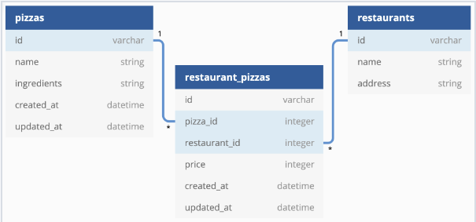

# FlaskPizzaAPI  [](https://flask.palletsprojects.com/) 


FlaskPizzaAPI is a powerful and flexible Flask-based API for managing pizza restaurants and their delicious pizza offerings. This project offers a wide range of features and endpoints to simplify restaurant and pizza management. Ensure data integrity and reliability with built-in data validations while effortlessly establishing relationships between restaurants and pizzas.

## Table of Contents
- [Installation](#installation)
- [Key Features](#key-features)
- [Models](#models)
- [Validations](#validations)
- [Routes](#routes)
- [Endpoints](#endpoints)
- [Contributing](#contributing)
- [License](#license)

---

## Installation

To run this project locally, follow these steps:

### Prerequisites

- Python 3.x installed on your system.

### Step 1: Clone the Repository

```shell
git clone git@github.com:Nganga-A/Flask-Pizza-Restaurants.git

```
### step 2: Create a Virtual Environment
Install `pipenv` if you haven't already:
```shell
pip install pipenv
```

### Step 3: Activate the Virtual Environment
```shell
pipenv install
pipenv shell
```

### Step 4: Install Dependencies
```shell
pip install -r requirements.txt
```
### Step 5: Run the Application
Start the Flask server:

```shell
python app.py
```


## Key Features

FlaskPizzaAPI offers a range of key features to simplify restaurant and pizza management:

- **CRUD Operations**: Create, read, update, and delete restaurants and pizzas with ease.

- **Data Validation**: Built-in data validations ensure that data quality is maintained. Restaurants must have unique names, and RestaurantPizza prices are validated to fall within the 1-30 range.

- **Relationships**: Establish relationships between restaurants and pizzas effortlessly. A Restaurant can have multiple pizzas through the RestaurantPizza model, and vice versa.

- **Detailed Information**: Retrieve comprehensive details about a restaurant, including its pizza offerings.

- **Seamless Integration**: Add new restaurant-pizza combinations to expand your pizza network with minimal effort.


## Models

The project defines the following models:

1. **Restaurant**: Represents a pizza restaurant with attributes `id`, `name`, and `address`.

2. **Pizza**: Represents a type of pizza with attributes `id`, `name`, `ingredients`, `created_at`, and `updated_at`.

3. **RestaurantPizza**: Represents the association between restaurants and pizzas with attributes `id`, `price`, `restaurant_id`, and `pizza_id`.




## Validations

The following validations are applied to the models:

- **`RestaurantPizza`**:
- Price must be between 1 and 30.

- **`Restaurant`**:
- Name must be less than 50 characters.
- Name must be unique.


## Routes

The API provides the following routes:

- `GET /restaurants`: Get a list of all restaurants.
- `GET /restaurants/:id`: Get details of a specific restaurant along with its pizzas.
- `DELETE /restaurants/:id`: Delete a restaurant and associated restaurant-pizza relationships.
- `GET /pizzas`: Get a list of all pizzas.
- `POST /restaurant_pizzas`: Create a new restaurant-pizza association.


## Endpoints

1. **GET /restaurants**
   - **Description**: Retrieve a list of all restaurants.
   - **Response Format**:
     ```json
     [
       {
        "address": "20493 Bennett Row Suite 275\nWardmouth, AR 65639",
        "id": 1,
        "name": "Bryan, Anderson and Cain"
       },
       {
        "address": "9065 Brett Stravenue Apt. 460\nBakerfort, OK 91687",
        "id": 2,
        "name": "Evans, Woodward and Singh"
       }
     ]
     ```

2. **GET /restaurants/:id**
   - **Description**: Retrieve a specific restaurant by ID.
   - **Response Format (if the restaurant exists)**:
     ```json
     {
       "id": 1,
       "name": "Bryan, Anderson and Cain",
       "address": "20493 Bennett Row Suite 275\nWardmouth, AR 65639",
       "pizzas": [
         {
           "id": 8,
           "ingredients": "Tomato Sauce, Mushrooms,   Mozzarella Cheese",
            "name": "Mushroom Lovers"
         },
         {
           "id": 10,
           "name": "Pesto Chicken",
           "ingredients": "Pesto Sauce, Chicken, Cherry Tomatoes, Mozzarella Cheese",
         }
       ]
     }
     ```
   - **Response Format (if the restaurant does not exist)**:
     ```json
     {
       "error": "Restaurant not found"
     }
     ```

3. **DELETE /restaurants/:id**
   - **Description**: Delete a specific restaurant by ID. Also, delete any associated RestaurantPizzas.
   - **Response Format (if the restaurant exists and is deleted)**:
     - Empty response body with the appropriate HTTP status code.
   - **Response Format (if the restaurant does not exist)**:
     ```json
     {
       "error": "Restaurant not found"
     }
     ```

4. **GET /pizzas**
   - **Description**: Retrieve a list of all pizzas.
   - **Response Format**:
     ```json
     [
       {
         "id": 1,
         "name": "Cheese",
         "ingredients": "Dough, Tomato Sauce, Cheese"
       },
       {
         "id": 2,
         "name": "Pepperoni",
         "ingredients": "Dough, Tomato Sauce, Cheese, Pepperoni"
       }
     ]
     ```

5. **POST /restaurant_pizzas**
   - **Description**: Create a new RestaurantPizza associated with an existing Pizza and Restaurant.
   - **Request Body Format**:
     ```json
     {
       "price": 5,
       "pizza_id": 1,
       "restaurant_id": 3
     }
     ```
   - **Response Format (if the RestaurantPizza is created successfully)**:
     ```json
     {
       "message": "Restaurant_pizza created successfully",
       "id": 1,
       "name": "Cheese",
       "ingredients": "Dough, Tomato Sauce, Cheese"
     }
     ```
   - **Response Format (if the RestaurantPizza is not created successfully)**:
     ```json
     {
       "errors": ["validation errors"]
     }
     ```

Feel free to explore and use these endpoints to manage your pizza restaurants effortlessly with FlaskPizzaAPI.

## Contributing

Contributions to this project are welcome. To contribute, follow these steps:

1. Fork the repository.
2. Create a new branch for your feature or bug fix.
3. Make your changes.
4. Submit a pull request to the `main` branch of the original repository.

## License

This project is licensed under the MIT License - see the [LICENSE](LICENSE) file for details.
